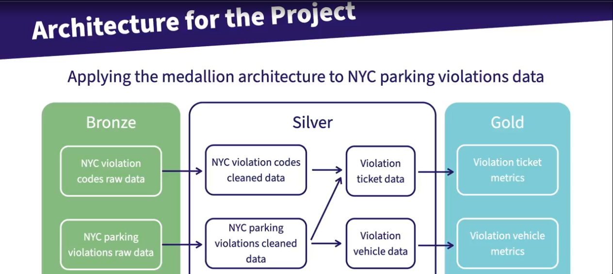

# dbt Learning Project

## Introduction

This repository contains my hands-on project developed while taking the course "Building Expertise in dbt for Data Engineering" by Mark Freeman.

The goal of this project is to consolidate my understanding of dbt (data build tool) concepts, best practices, and real-world data engineering workflows by building a structured, production-like data transformation pipeline.

## What You'll Find Here

This project walks through the full lifecycle of a dbt project, including:

- Environment setup
- Data modeling
- Testing and documentation
- Deployment-ready practices

## Course Topics Covered

The repository is structured around the following topics:

- Prepare Your Coding Environment
- Prepare Your Database Environment
- Create a dbt Project
- Prepare Your dbt Environment
- Your First dbt Model
- Introduction to dbt ref() Function
- Implementing Medallion Architecture with dbt
- Materialization of dbt Models
- Documentation as Code via dbt
- Implementing Tests within Your dbt Project
- Deploying Your dbt Project

## Project Architecture

Below is the architecture used in this project:

The project follows a Medallion Architecture (Bronze, Silver, Gold) approach to organize data transformations and ensure scalability and maintainability.

## Key Learnings

Some of the main concepts explored in this project:

- Building modular and reusable data models with dbt
- Applying different materializations (views, tables, incremental)
- Structuring transformations using Medallion Architecture
- Writing tests to ensure data quality
- Generating documentation automatically
- Preparing a project for deployment

## Next Steps

Potential improvements for this project:

- Add CI/CD integration (e.g., GitHub Actions)
- Integrate with orchestration tools (e.g., Airflow)
- Expand test coverage
- Add more complex incremental models
- Connect to a production-grade data warehouse